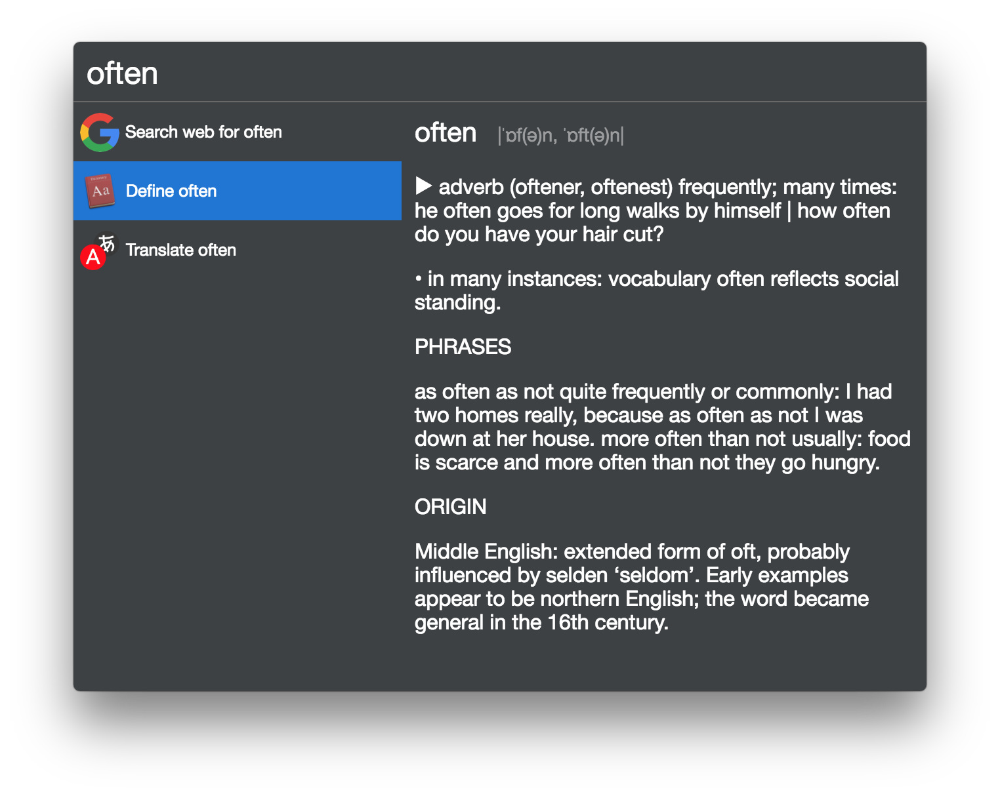

# cerebro-osx-define

> [Cerebro](https://cerebroapp.com) plugin to define entered text in OSx dictionary

## Usage

In Cerebro, type any text that you want to define and move selection to define result. Result from built-in dictionary will be displayed in preview.

## FAQ

### "Can't fetch dictionary results."

You may need to run `python -m pip install pyobjc` in the terminal to install requied python dependency for accessing MacOS Dict.

## Related

* [Cerebro](http://github.com/KELiON/cerebro) – main repo for Cerebro app;
* [cerebro-plugin](https://github.com/KELiON/cerebro-plugin) – boilerplate to create plugins for Cerebro app.

## License

MIT © [Alexandr Subbotin](http://asubbotin.ru)
